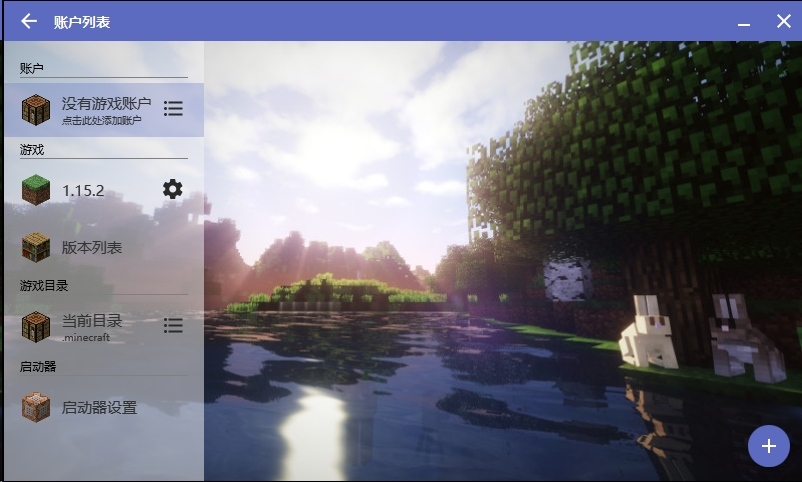
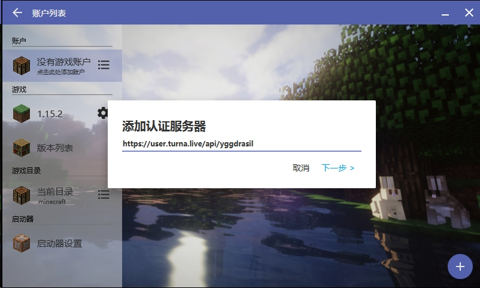
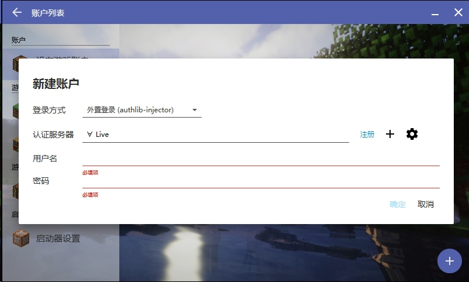
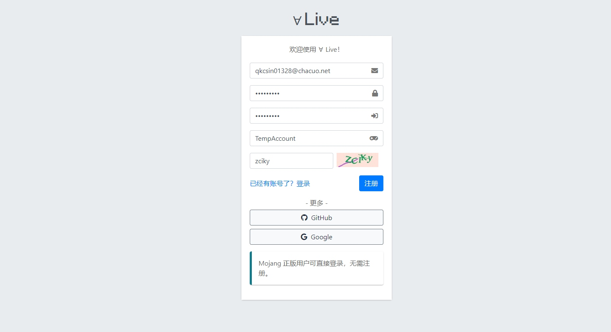
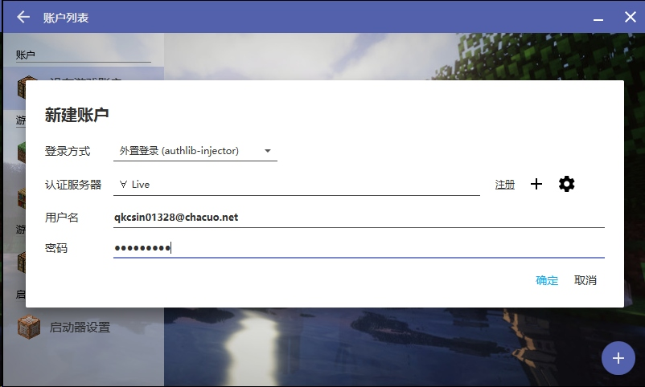
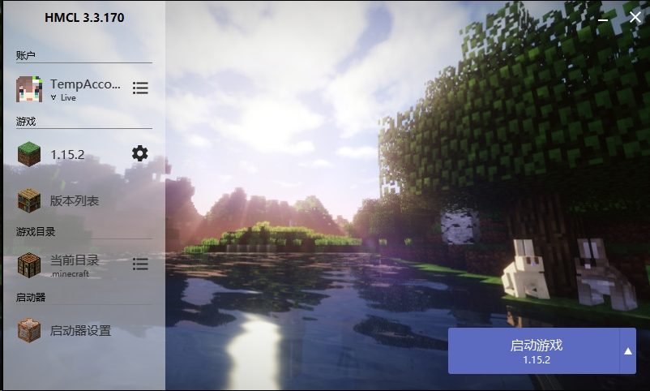

## 通过 Authlib-Injector 外置登录连接到服务器（HMCL）

1. 在启动器账户页面点击加号新建账户，登录方式选择外置登录：

1. 认证服务器一栏点击加号:
填写认证服务器地址: `https://user.turna.live/api/yggdrasil`

3. 当出现此界面时即添加成功，点击注册跳转到∀Live注册页面:

4. 填写相关信息完成注册:

5. 注册完成后回到HMCL填写账号密码完成登录:

6. [开始玩耍](/game/Opening)吧!

