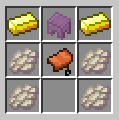
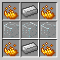

## 概览

本服务器在玩法上尽可能遵循原版 Minecraft 流程，并未添加与原版 Minecraft 相左的设定，大多数被广泛使用的特性也并未禁用，未来若有必要调整也将尽力保证与 "Vanilla" Minecraft 的一致性。

> *生电安心宣言～*

在此基础上根据实际需求我们对服务端设定做出了一些必要的调整，本页面将对其做详细介绍。

## 传送系统

&#8195;本服务器基于 Essentials 插件建立了全维度可用的传送系统*，开放功能如下：

1. 家园传送 <kbd>/homes</kbd> <kbd>/home</kbd> <kbd>/sethome</kbd> <kbd>/delhome</kbd>

1. 出生点传送 <kbd>/spawn</kbd>

1. 回溯传送 <kbd>/back</kbd>

1. 玩家间传送 <kbd>/tpa</kbd> <kbd>/tpahere</kbd> <kbd>/tpaccept</kbd>

&#8195;各个指令的具体用法这里不再赘述，请访问 [Essentials](https://mineplugin.org/Essentials#.E4.BC.A0.E9.80.81) 百科页面查看具体用法

&#8195;*: 出于建筑工程需要及材料节约目的以上传送指令均无延时或冷却，但管理员将保留对滥用行为的追究权利

## 任务列表

&#8195;本服务器建立了公共任务列表，请使用 <kbd>!!task</kbd> 指令访问

&#8195;要查看指令帮助请使用 <kbd>!!task help</kbd>

## 备份系统

&#8195;本服务器部署了全局备份系统

&#8195;输入 <kbd>!!qb</kbd> 以查看帮助，此处不再复述详细用法，你应当在充分了解使用方法的前提下操作

&#8195;在进行可能对其他玩家造成不可逆影响的大型工程前请**务必**备份，若你不知道如何操作可以在群内请活跃玩家代为操作

## 方块变更日志查询

&#8195;本服安装了 CoreProtect 并向全体玩家开放查询功能，使用 <kbd>/co i</kbd> 开关

&#8195;开启后攻击键点击方块查询方块放置/破坏日志，使用键点击方块查询方块实体数据变更日志

&#8195;使用后再次运行 <kbd>/co i</kbd> 关闭查询，恢复正常方块交互状态

## 合成配方

*注：当前以下合成配方在新周目中并未启用，其将在适当时候被重新启用*

物品 | 材料 | 配方示意图
-|-|-
鞘翅 | 金锭 　×2  鞍　　 ×1  幻翼膜 ×4　  潜影壳 ×1 | 
附魔金苹果 | 金苹果 ×1  下界之星 ×1 | （无序合成）
石英 | 烈焰粉 ×4  玻璃 ×3  铁锭 ×2 | 

## 物品复制

### &#8194;允许的范围

~~石英块~~\[1]、海绵、~~鞘翅~~\[2]、~~附魔金苹果~~\[2]、沙子\[3]、铁砧\[3]

\[1]: 现请使用村民交易所或从石英合成

\[2]: 参考：合成配方

\[3]: 请使用重力方块复制机

### &#8194;注意事项

1. 请勿在许可范围外使用物品复制特性
1. 物品复制请根据需求进行，如非必要不建议进行。
1. 复制而来的物品使用条件是被限制的，若您将其囤积或用于不合适的地方管理员*可能*会对物品进行适当的处理。

注：由于 Mojang 的奇妙平衡设计，在多人游戏中许多物品获取<ruby>难度<rt>可能性</rt></ruby>与其用途广泛程度不成比例，使得游戏内工程推进难度大且玩家间物资难以公平分配，进而导致原版世界在不额外添加资源输入（如：资源世界、系统交易等）的情况下难以长久运行。

广泛利用生存电路技巧并小范围许可物品复制目前是一个折衷的解决方案。目前有计划添加或修改原版特性来补足这一点。未来可能会对物品复制进行限制，故在进行复制前请多留意本页面的变更。

